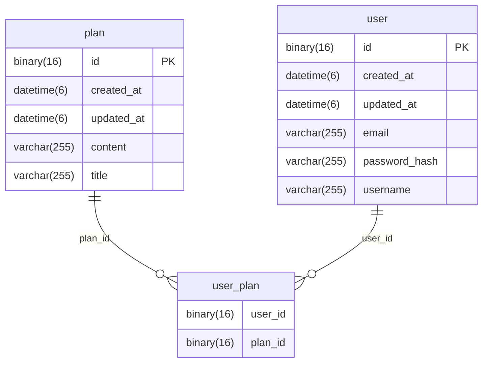

# PlannerService

Spring 숙달을 위한 회원형 일정 관리 서비스 구현 과제

## 사용법

Spring 프로젝트를 클론하고, 다음 파일을 설정합니다.

> /src/main/resources/application-env.properties
```aiignore
spring.datasource.url=
spring.datasource.username=
spring.datasource.password=
jwt.secret.key=
```

## API 명세

### 사용자 관리

| 기능 | 메서드 | 엔드포인트 | 역할 | 요청 형식 | 응답 형식 |
| --- | --- | --- | --- | --- | --- |
| 로그인 | POST | /api/auth/login | . | 로그인 json | 없음`JWT 쿠키` |
| 회원가입 | POST | /api/user/register | . | 가입 json | 사용자 json |
| 페이지 조회 | GET | /api/user | . | . | 사용자 리스트 json |
| 조회 | GET | /api/user/id/{id} | . | . | 사용자 json |
| 조회(사용자) | GET | /api/user/self | 사용자`JWT 쿠키` | . | 사용자 json |
| 수정(관리자) | PUT | /api/user/id/{id} | 관리자`환경변수` | 수정 json | . |
| 수정(사용자) | PUT | /api/user/self | 사용자`JWT 쿠키` | 수정 json | . |
| 삭제(관리자) | DELETE | /api/user/id/{id} | 관리자`환경변수` | . | . |
| 삭제(사용자) | DELETE | /api/user/self | 사용자`JWT 쿠키` | . | . |

### 일정 관리

| 기능 | 메서드 | 엔드포인트 | 역할 | 요청 형식 | 응답 형식 |
| --- | --- | --- | --- | --- | --- |
| 작성 | POST | /api/plan | 사용자`JWT 쿠키` | 작성 json | 일정 json |
| 페이지 조회 | GET | /api/plan | 사용자`JWT 쿠키` | 필터, 페이징 query | 일정 리스트 json |
| 조회 | GET | /apl/plan/id/{id} | 사용자`JWT 쿠키` | . | 일정 json |
| 수정 | PUT | /api/plan/id/{id} | 사용자`JWT 쿠키` | 수정 json | . |
| 사용자 참여 | PUT | /api/plan/id/{id}/join | 사용자`JWT 쿠키` | 사용자 id json | . |
| 삭제 | DELETE | /api/plan/id/{id} | 사용자`JWT 쿠키` | . | . |

## 개체 관계도 (ERD)

