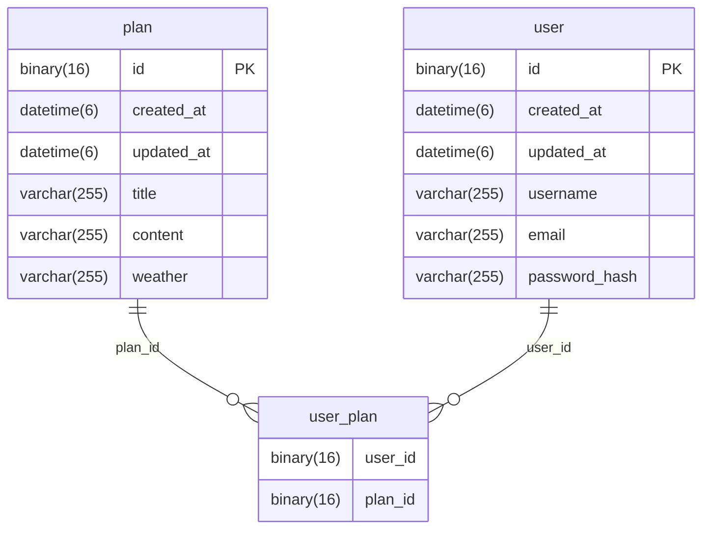

# PlannerService

> Assignment to implement `User Oriented Planner Service BE` to improve Spring dev skills

## Stacks
<div style="display: inline">
    
     
     <br>
      
</div>

## Dev
- [34-43](https://github.com/34-43)

## Usage

You have to prepare these requirements to run.

> - JDBC compatible DB server
> - random base64 secret key (length > 10 chars)

If prepared,
Add these Environment variables in `application-env.properties`.
```aiignore
spring.datasource.url=
spring.datasource.username=
spring.datasource.password=
jwt.secret.key=
```
This is the location.
> /src/main/resources/application-env.properties

## API table

<h3>인증 Authentications</h3>
<table>
    <tr>
        <th>API</th>
        <th>Method</th>
        <th>EndPoint</th>
        <th>Request</th>
        <th>Response</th>
        <th>Status</th>
        <th>Role</th>
    </tr>
    <tr>
        <td>로그인</td>
        <td>POST</td>
        <td><code>/api/auth/login</code></td>
        <td><code>json (email, password)</code></td>
        <td><code>JWT Cookies</code></td>
        <td>200</td>
        <td></td>
    </tr>
    <tr>
        <td>로그아웃</td>
        <td>POST</td>
        <td><code>/api/auth/logout</code></td>
        <td></td>
        <td></td>
        <td>204</td>
        <td>USER</td>
    </tr>
</table>

<h3>회원 관리 User Managements</h3>
<table>
    <tr>
        <th>API</th>
        <th>Method</th>
        <th>EndPoint</th>
        <th>Request</th>
        <th>Response</th>
        <th>Status</th>
        <th>Role</th>
    </tr>
    <tr>
        <td>회원 가입</td>
        <td>POST</td>
        <td><code>/api/users</code></td>
        <td><code>json (username, email, password)</code></td>
        <td><code>json (username, email, role, id, createdAt, updatedAt)</code></td>
        <td>201</td>
        <td></td>
    </tr>
    <tr>
        <td>회원 전체 조회</td>
        <td>GET</td>
        <td><code>/api/users</code></td>
        <td></td>
        <td><code>json list (username, email)</code></td>
        <td>200</td>
        <td></td>
    </tr>
    <tr>
        <td>회원 조회</td>
        <td>GET</td>
        <td><code>/api/users/self</code></td>
        <td></td>
        <td><code>json (username, email, role, id, createdAt, updatedAt)</code></td>
        <td>200</td>
        <td>USER</td>
    </tr>
    <tr>
        <td>회원 수정</td>
        <td>PUT</td>
        <td><code>/api/users/self</code></td>
        <td><code>json (username, email, password)</code></td>
        <td></td>
        <td>204</td>
        <td>USER</td>
    </tr>
    <tr>
        <td>회원 삭제</td>
        <td>DELETE</td>
        <td><code>/api/users/self</code></td>
        <td></td>
        <td></td>
        <td>204</td>
        <td>USER</td>
    </tr>
    <tr>
        <td>회원 조회 (관리자)</td>
        <td>GET</td>
        <td><code>/api/users/id/{id}</code></td>
        <td><code>path (id)</code></td>
        <td><code>json (username, email, role, id, createdAt, updatedAt)</code></td>
        <td>200</td>
        <td>ADMIN</td>
    </tr>
    <tr>
        <td>회원 수정 (관리자)</td>
        <td>PUT</td>
        <td><code>/api/users/id/{id}</code></td>
        <td><code>path (id), json (username, email, password)</code></td>
        <td></td>
        <td>204</td>
        <td>ADMIN</td>
    </tr>
    <tr>
        <td>회원 삭제 (관리자)</td>
        <td>DELETE</td>
        <td><code>/api/users/id/{id}</code></td>
        <td><code>path (id)</code></td>
        <td></td>
        <td>204</td>
        <td>ADMIN</td>
    </tr>
</table>

<h3>계획 관리 Plan Managements</h3>
<table>
    <tr>
        <th>API</th>
        <th>Method</th>
        <th>EndPoint</th>
        <th>Request</th>
        <th>Response</th>
        <th>Status</th>
        <th>Role</th>
    </tr>
    <tr>
        <td>계획 생성</td>
        <td>POST</td>
        <td><code>/api/plans</code></td>
        <td><code>json (title, content)</code></td>
        <td><code>json (title, content, weather, id, createdAt, updatedAt)</code></td>
        <td>201</td>
        <td>USER</td>
    </tr>
    <tr>
        <td>계획 전체 조회</td>
        <td>GET</td>
        <td><code>/api/plans</code></td>
        <td><code>query (page, size, sortBy, order)</code></td>
        <td><code>json list (title, content, weather, id, createdAt, updatedAt)</code></td>
        <td>200</td>
        <td>USER</td>
    </tr>
    <tr>
        <td>계획 전체 조회 (관리자)</td>
        <td>GET</td>
        <td><code>/api/plans</code></td>
        <td><code>query (page, size, sortBy, order)</code></td>
        <td><code>json list (title, content, weather, id, createdAt, updatedAt)</code></td>
        <td>200</td>
        <td>ADMIN</td>
    </tr>
    <tr>
        <td>계획 조회</td>
        <td>GET</td>
        <td><code>/api/plans/id/{id}</code></td>
        <td><code>path (id)</code></td>
        <td><code>json (title, content, weather, id, createdAt, updatedAt)</code></td>
        <td>200</td>
        <td>USER</td>
    </tr>
    <tr>
        <td>계획 수정</td>
        <td>PUT</td>
        <td><code>/api/plans/id/{id}</code></td>
        <td><code>path (id), json (title, content)</code></td>
        <td></td>
        <td>204</td>
        <td>USER</td>
    </tr>
    <tr>
        <td>계획 삭제</td>
        <td>DELETE</td>
        <td><code>/api/plans/id/{id}</code></td>
        <td><code>path (id)</code></td>
        <td></td>
        <td>204</td>
        <td>USER</td>
    </tr>
    <tr>
        <td>계획 참여 회원 추가</td>
        <td>PUT</td>
        <td><code>/api/plans/id/{id}/users/{userId}</code></td>
        <td><code>path (id, userId)</code></td>
        <td></td>
        <td>204</td>
        <td>USER</td>
    </tr>
    <tr>
        <td>계획 참여 회원 삭제</td>
        <td>DELETE</td>
        <td><code>/api/plans/id/{id}/users/self</code></td>
        <td><code>path (id)</code></td>
        <td></td>
        <td>204</td>
        <td>USER</td>
    </tr>
</table>


## Entity Relationship Diagram

